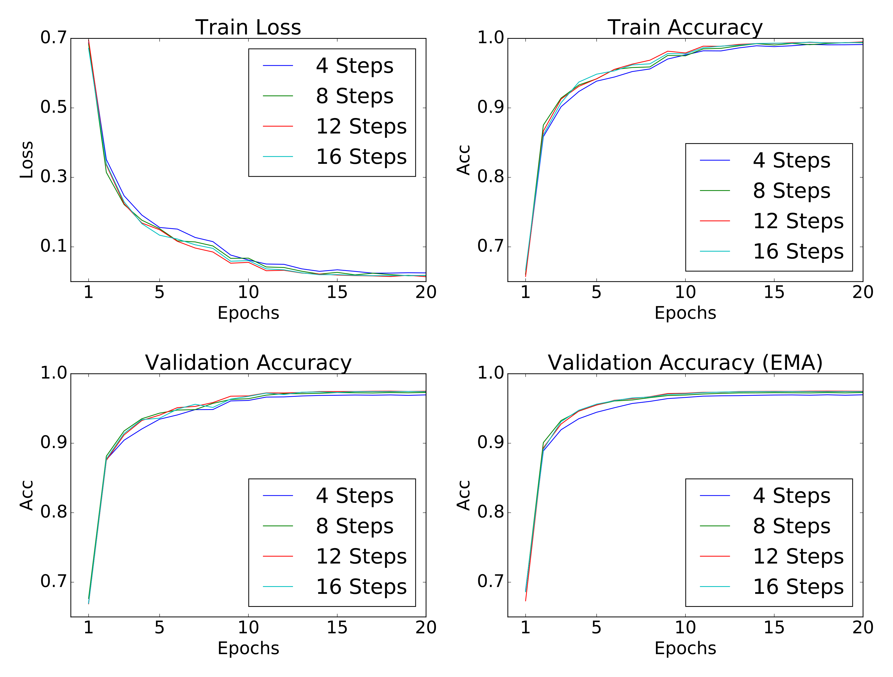

# Pytorch implementation of the MAC-Network

This is a Pytorch implementation of the 2018 ICLR Paper [Compositional Attention Networks for Machine Reasoning](https://arxiv.org/abs/1803.03067) (MAC Network), based mostly on the [original implementation](https://github.com/stanfordnlp/mac-network) by the authors and partly (mainly question preprocessing) on the implementation by [rosinality](https://github.com/rosinality/mac-network-pytorch).

**Requirements**:
```
pip install -r requirements.txt
```

**Prepare dataset**:
- Download and extract [CLEVR v1.0 dataset](http://cs.stanford.edu/people/jcjohns/clevr/)
- Preprocess question data:  `python preprocess.py [CLEVR directory]`
- Extract image features with ResNet 101 as described in the original [Git](https://github.com/stanfordnlp/mac-network#feature-extraction)
- Put extracted features and preprocessed question data into the `data` folder so you have the following files:
    - `data/train_features.h5`
    - `data/val_features.h5`
    - `data/train.pkl`
    - `data/val.pkl`
    - `data/dic.pkl`

**To train**:
```
python code/main.py --cfg cfg/clevr_train_mac.yml --gpu 0
```
- The number of reasoning steps can be changed through the config file (`TRAIN -> MAX_STEPS`) - default value is `4`.
- Training progress can be visualized via `tensorboard --logdir data/`
- The basic implementation closely mirrors the parameters and config settings from the original implementation's args.txt, i.e. this line in the original [Git](https://github.com/stanfordnlp/mac-network#model-variants): `python main.py --expName "clevrExperiment" --train --testedNum 10000 --epochs 25 --netLength 4 @configs/args.txt` (we evaluate on the full validation set though)

**Results**:
- We train the model on a NVIDIA GeForce RTX 2080 Ti.
- The model with `MAX_STEPS=4/8/12/16` needs about 2.4 / 3.2 / 4.2 / 5.1 GB VRAM.
- Training time is about 19/34/41/50 minutes for one epoch for the model with `MAX_STEPS=4/8/12/16`.
- Our implementation reaches around 93-95% accuracy on the validation set after five epochs, 95-96% after ten epochs, 97-98% after 20 epochs.

Development of training loss and accuracies throughout the training process for different numbers of reasoning steps:

